# Iris v3 - Detailed Turn Flow

**Complete Technical Flow from User Input to Assistant Response**

This document provides a comprehensive, step-by-step flowchart showing every operation that occurs during a conversation turn, with special detail on tool execution.

---

## Complete Conversation Turn Flow

```mermaid
flowchart TD
    Start([User Sends Message<br/>+ Optional Images]) --> WS_Receive[WebSocket Receives JSON<br/>message + images array]
    
    WS_Receive --> ParseInput[Parse user message<br/>Extract base64 images]
    ParseInput --> ValidateInput{Message or<br/>images present?}
    ValidateInput -->|No| SendError[Send Error to User]
    ValidateInput -->|Yes| SaveUserStart[conversation.add_user_message]
    
    SaveUserStart --> SaveImages{Images<br/>present?}
    SaveImages -->|Yes| DecodeImages[Decode base64 images]
    DecodeImages --> CreateDir[Create attachments/user/<br/>session_id/ directory]
    CreateDir --> WriteFiles[Write PNG files to disk]
    WriteFiles --> CreateMetadata[Create attachment metadata<br/>path, mime_type, size]
    CreateMetadata --> SaveUserDB[INSERT into chat_history<br/>role='user', attachments JSON]
    
    SaveImages -->|No| SaveUserDB
    SaveUserDB --> ContextStart[system_prompt.assemble_full_context]
    
    %% Context Assembly Detail
    ContextStart --> QueryInstructions[Query: SELECT instruction_text<br/>FROM system_instructions<br/>WHERE active=true]
    QueryInstructions --> QueryTraits[Query: SELECT name, value, description<br/>FROM character_traits]
    QueryTraits --> QueryMemories[Query: SELECT memory_text<br/>FROM episodic_memories<br/>with vector similarity]
    QueryMemories --> ConcatSystem[Concatenate into<br/>system message]
    
    ConcatSystem --> GetMessages[conversation.get_messages<br/>from memory]
    GetMessages --> ProcessMsgs[For each message in history]
    ProcessMsgs --> CheckAttach{Message has<br/>attachments?}
    
    CheckAttach -->|Yes| ParseJSON[Parse attachments JSON]
    ParseJSON --> ReadFiles[Read image files from disk]
    ReadFiles --> EncodeB64[Encode images to base64]
    EncodeB64 --> AddImages[Add 'images' array to message]
    AddImages --> NextMsg{More<br/>messages?}
    
    CheckAttach -->|No| NextMsg
    NextMsg -->|Yes| ProcessMsgs
    NextMsg -->|No| BuildArray[Build complete context array<br/>system + history with images]
    
    BuildArray --> CountTokens[Count total tokens<br/>using tiktoken]
    CountTokens --> CheckLimit{Exceeds<br/>12K tokens?}
    CheckLimit -->|Yes| TruncateOld[Remove oldest messages]
    TruncateOld --> CountTokens
    CheckLimit -->|No| ContextReady[Context Ready]
    
    %% Tool Loading
    ContextReady --> LoadTools[tool_manager.get_tool_definitions]
    LoadTools --> QueryTools[Query: SELECT tool_name, schema<br/>FROM mcp_tools WHERE enabled=true]
    QueryTools --> FormatTools[Format as Ollama tool schemas]
    
    %% First Ollama Call
    FormatTools --> BuildPayload1[Build Ollama payload<br/>model, messages, tools, options]
    BuildPayload1 --> SetContext[Set num_ctx=32768<br/>CRITICAL!]
    SetContext --> HttpPost1[POST to localhost:11434/api/chat<br/>stream=false]
    HttpPost1 --> WaitResponse1[Wait for complete response]
    WaitResponse1 --> ParseResponse[Parse JSON response]
    
    ParseResponse --> CheckToolCalls{response.message<br/>has tool_calls?}
    
    %% Tool Execution Path (DETAILED)
    CheckToolCalls -->|Yes| NotifyUser1[Send WebSocket:<br/>type='tool_start'<br/>tool_count=N]
    NotifyUser1 --> LoopStart{For each<br/>tool_call}
    
    LoopStart --> ExtractTool[Extract:<br/>function.name<br/>function.arguments]
    ExtractTool --> QueryIcon[Query: SELECT icon<br/>FROM mcp_tools<br/>WHERE tool_name=?]
    QueryIcon --> NotifyExec[Send WebSocket:<br/>type='tool_executing'<br/>tool_name, icon, args]
    
    NotifyExec --> CheckConnected{MCP Client<br/>connected?}
    CheckConnected -->|No| ConnectMCP[mcp_client.connect_all]
    ConnectMCP --> StartServers[Start MCP server subprocesses<br/>via subprocess.Popen]
    StartServers --> WaitReady[Wait for server ready signal]
    
    CheckConnected -->|Yes| FindServer[Look up server for tool<br/>in server_configs]
    WaitReady --> FindServer
    
    FindServer --> BuildRPC[Build JSON-RPC request<br/>method='tools/call'<br/>params=arguments]
    BuildRPC --> WriteStdin[Write JSON to server stdin]
    WriteStdin --> ReadStdout[Read JSON from server stdout<br/>with 120s timeout]
    ReadStdout --> ParseToolResult[Parse tool result]
    
    ParseToolResult --> CheckImage{Result has<br/>filename field?}
    CheckImage -->|Yes| LoadImage[Read image from<br/>attachments/generated/]
    LoadImage --> EncodeImage[Encode to base64]
    EncodeImage --> SendImageWS[Send WebSocket:<br/>type='image'<br/>image data, filename]
    SendImageWS --> FormatResult[Format tool result with<br/>response_instructions]
    
    CheckImage -->|No| FormatResult
    FormatResult --> NotifySuccess[Send WebSocket:<br/>type='tool_result'<br/>success=true/false]
    
    NotifySuccess --> MoreTools{More<br/>tool_calls?}
    MoreTools -->|Yes| LoopStart
    MoreTools -->|No| SaveAssistantTools[conversation.add_assistant_message<br/>content='', tool_calls=JSON]
    
    SaveAssistantTools --> SaveAssistDB[INSERT into chat_history<br/>role='assistant'<br/>tool_calls JSON]
    SaveAssistDB --> SaveToolLoop{For each<br/>tool result}
    
    SaveToolLoop --> SaveToolMsg[conversation.add_tool_message<br/>content, tool_name, images]
    SaveToolMsg --> SaveToolDB[INSERT into chat_history<br/>role='tool', tool_name<br/>attachments JSON]
    SaveToolDB --> NextToolSave{More<br/>results?}
    NextToolSave -->|Yes| SaveToolLoop
    NextToolSave -->|No| ReassembleContext[Call assemble_full_context AGAIN<br/>now includes tool results]
    
    ReassembleContext --> ContextWithTools[Updated context array with<br/>assistant + tool messages]
    
    %% Second Ollama Call
    ContextWithTools --> BuildPayload2[Build Ollama payload<br/>NO tools this time]
    BuildPayload2 --> HttpPost2[POST to localhost:11434/api/chat<br/>stream=true]
    HttpPost2 --> StreamLoop[Read response stream<br/>line by line]
    StreamLoop --> ParseChunk[Parse JSON chunk]
    ParseChunk --> ExtractText[Extract message.content]
    ExtractText --> SendChunk[Send WebSocket:<br/>type='chunk'<br/>content=text]
    SendChunk --> AppendBuffer[Append to response buffer]
    AppendBuffer --> MoreChunks{More<br/>chunks?}
    MoreChunks -->|Yes| StreamLoop
    MoreChunks -->|No| StreamComplete[Streaming complete]
    
    %% Direct Response Path (No Tools)
    CheckToolCalls -->|No| GetContent[Extract response.message.content]
    GetContent --> SendDirect[Send WebSocket:<br/>type='chunk'<br/>content=response]
    SendDirect --> SaveDirectMsg[conversation.add_assistant_message<br/>content=response]
    SaveDirectMsg --> SaveDirectDB[INSERT into chat_history<br/>role='assistant'<br/>message=response]
    SaveDirectDB --> SendDone1[Send WebSocket:<br/>type='done']
    SendDone1 --> End
    
    %% Final Save After Tools
    StreamComplete --> CheckToolImages{Tool generated<br/>images?}
    CheckToolImages -->|Yes| CopyImages[Copy image base64 from<br/>tool results]
    CopyImages --> SaveFinalMsg[conversation.add_assistant_message<br/>content=full_response<br/>images=tool_images]
    CheckToolImages -->|No| SaveFinalMsg
    
    SaveFinalMsg --> SaveFinalDB[INSERT into chat_history<br/>role='assistant'<br/>message, attachments JSON]
    SaveFinalDB --> SendDone2[Send WebSocket:<br/>type='done'<br/>message_count=N]
    SendDone2 --> End([Turn Complete])
    
    %% Styling
    style Start fill:#e1f5ff
    style End fill:#e1ffe1
    style CheckToolCalls fill:#fff4e1
    style LoopStart fill:#ffe1e1
    style SaveToolLoop fill:#ffe1e1
    style ValidateInput fill:#fff4e1
    style SaveImages fill:#fff4e1
    style CheckAttach fill:#fff4e1
    style NextMsg fill:#fff4e1
    style CheckLimit fill:#fff4e1
    style CheckConnected fill:#fff4e1
    style CheckImage fill:#fff4e1
    style MoreTools fill:#fff4e1
    style NextToolSave fill:#fff4e1
    style MoreChunks fill:#fff4e1
    style CheckToolImages fill:#fff4e1
```

---

## Key Sections Explained

### 1. Input Processing (Lines 1-10)
- WebSocket receives JSON with message and optional images
- Validates input (must have message or images)
- If images: decode base64, create directories, write files, create metadata
- Save user message to database with attachments JSON

### 2. Context Assembly (Lines 11-30)
- **System Prompt**: Query database for instructions, traits, memories
- **History Loading**: Get messages from conversation object
- **Image Processing**: For each message with attachments:
  - Parse JSON
  - Read files from disk
  - Encode to base64
  - Add to message's 'images' array
- **Token Counting**: Use tiktoken to count total tokens
- **Truncation**: If over 12K tokens, remove oldest messages iteratively

### 3. Tool Loading (Lines 31-35)
- Query database for enabled tools
- Format as Ollama-compatible tool schemas
- Cache in memory for this request

### 4. First Ollama Call (Lines 36-42)
- Build payload with messages, tools, and critical `num_ctx=32768`
- POST to Ollama API (non-streaming)
- Wait for complete response
- Parse to check for tool_calls

### 5. Tool Execution Path (Lines 43-80) - THE COMPLEX PART
When Ollama calls tools, this happens:

**A. Setup**:
- Notify user via WebSocket (tool_start message)
- Loop through each tool call

**B. Per Tool**:
1. Extract tool name and arguments
2. Query database for tool icon
3. Notify user tool is executing (with icon)
4. Check if MCP client is connected
5. If not: Start MCP server subprocesses, wait for ready
6. Find which server handles this tool
7. Build JSON-RPC request
8. Write to server stdin
9. Read from server stdout (120s timeout)
10. Parse result

**C. Image Handling** (if tool generated image):
1. Check if result has 'filename' field
2. Load image from attachments/generated/
3. Encode to base64
4. Send to user via WebSocket (type='image')

**D. Save Results**:
1. Format tool result with response_instructions
2. Notify user of success/failure
3. After all tools: Save assistant message (empty content, tool_calls JSON)
4. Save each tool result message (role='tool', tool_name, attachments)

**E. Reassemble Context**:
- Call assemble_full_context AGAIN
- Now includes: user → assistant (with tool_calls) → tool result(s)

### 6. Second Ollama Call (Lines 81-90)
- Build new payload (NO tools this time)
- POST to Ollama API (streaming=true)
- Read response line by line
- Parse each JSON chunk
- Extract text content
- Send to user immediately (type='chunk')
- Accumulate in buffer

### 7. Direct Response Path (Lines 91-96)
If NO tools were called:
- Extract response text directly
- Send to user
- Save to database
- Send done signal

### 8. Final Save (Lines 97-105)
After streaming completes:
- Check if tools generated images
- If yes: Copy image base64 from tool results
- Save complete assistant message (with tool images as attachments)
- Send done signal with final message count

---

## Critical Operations

### Database Operations
1. **User message**: INSERT with attachments JSON
2. **Assistant with tools**: INSERT with empty content, tool_calls JSON
3. **Tool results**: INSERT for each result with tool_name, attachments JSON
4. **Final assistant**: INSERT with full response, optional attachments JSON

### File Operations
1. **User images**: Write to `attachments/user/{session_id}/`
2. **Tool images**: Read from `attachments/generated/{session_id}/`
3. **Context loading**: Read all images referenced in attachments JSON

### Network Operations
1. **Ollama call 1**: POST with tools (non-streaming)
2. **MCP calls**: JSON-RPC via stdin/stdout for each tool
3. **Ollama call 2**: POST streaming (if tools used)
4. **WebSocket**: Multiple message types to user (start, tool_executing, tool_result, image, chunk, done)

### Memory Operations
1. **Context assembly**: Build array in memory
2. **Token counting**: Calculate tokens for truncation
3. **Response buffering**: Accumulate streamed chunks

---

## Decision Points

| Decision | Condition | Path A | Path B |
|----------|-----------|--------|--------|
| Input Valid? | message or images present | Continue | Send error |
| Has Images? | images array not empty | Process images | Skip to DB save |
| Over Token Limit? | tokens > 12K | Truncate oldest | Continue |
| MCP Connected? | client._connected | Use existing | Connect servers |
| Tool Calls? | response has tool_calls | Execute tools → stream | Direct response → done |
| Tool Has Image? | result has filename | Load & send image | Skip to format |
| More Tool Calls? | index < len(tool_calls) | Loop again | Continue |
| More Chunks? | stream not ended | Read next | Complete |

---

## Timing Estimates

| Phase | Typical Duration |
|-------|-----------------|
| Input processing | <10ms |
| Context assembly | 50-200ms (depends on images) |
| Tool loading | <5ms (cached) |
| First Ollama call | 500-2000ms |
| Tool execution | 100ms - 30s per tool |
| Second Ollama call | 1-10s (streaming) |
| Database saves | 5-20ms each |
| **Total (no tools)** | 1-3 seconds |
| **Total (with tools)** | 3-30+ seconds |

---

## Error Handling Points

1. **Invalid input**: Send error message, stop
2. **Image decode failure**: Log error, continue without image
3. **Database error**: Log error, may fail entire operation
4. **MCP connection failure**: Return tool error to Ollama
5. **Tool execution timeout**: 120s timeout, return error
6. **Ollama timeout**: 120s timeout, return error to user
7. **Token overflow**: Truncate oldest messages automatically

---

## File Locations

| Operation | Code File | Key Function |
|-----------|-----------|--------------|
| WebSocket handling | `app/api/routes_chat.py` | `websocket_chat()` |
| User message save | `core/conversation.py` | `add_user_message()` |
| Context assembly | `core/system_prompt.py` | `assemble_full_context()` |
| Tool execution | `mcp_servers/tool_manager.py` | `execute_tool()` |
| MCP communication | `mcp_servers/mcp_client.py` | `call_tool()` |
| Ollama calls | `ollama/client.py` | `chat_completion_with_tools()`, `chat_completion_stream()` |
| Database operations | `database/persistence.py` | `save_message()`, `load_recent_conversation()` |

---

**Document Version**: 1.0  
**Generated**: December 6, 2025  
**Reflects**: Iris v3.0.0 actual implementation
