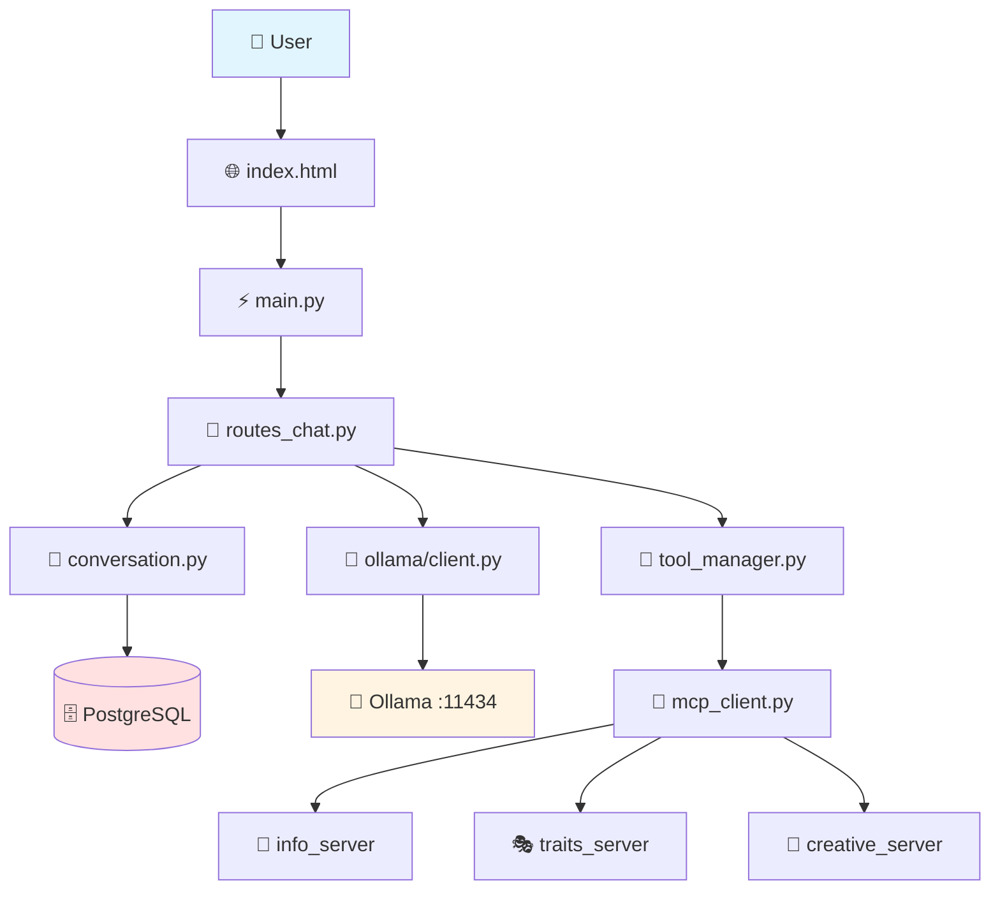
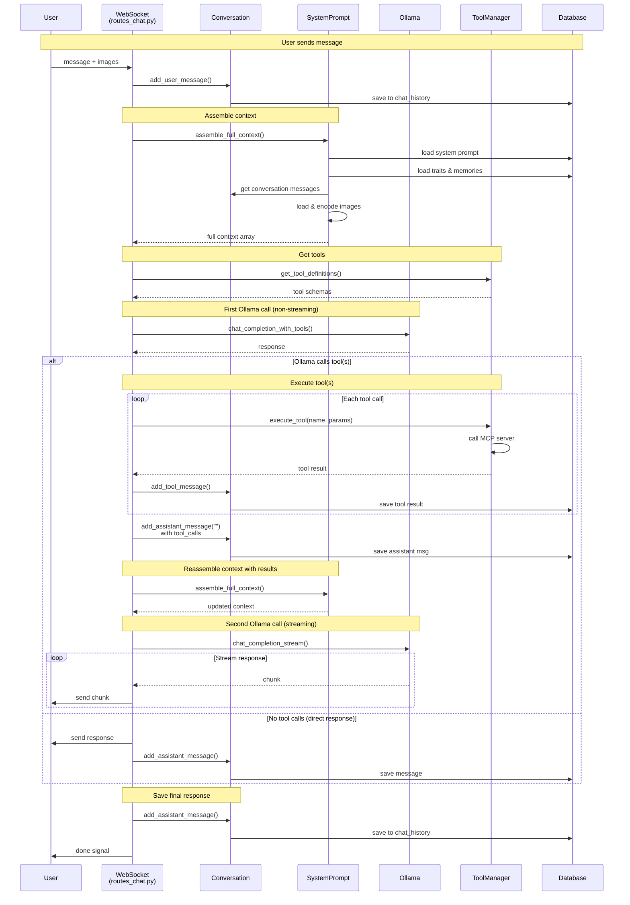
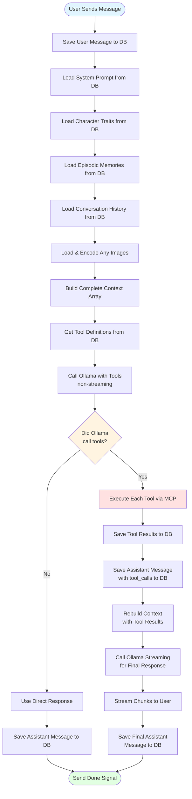
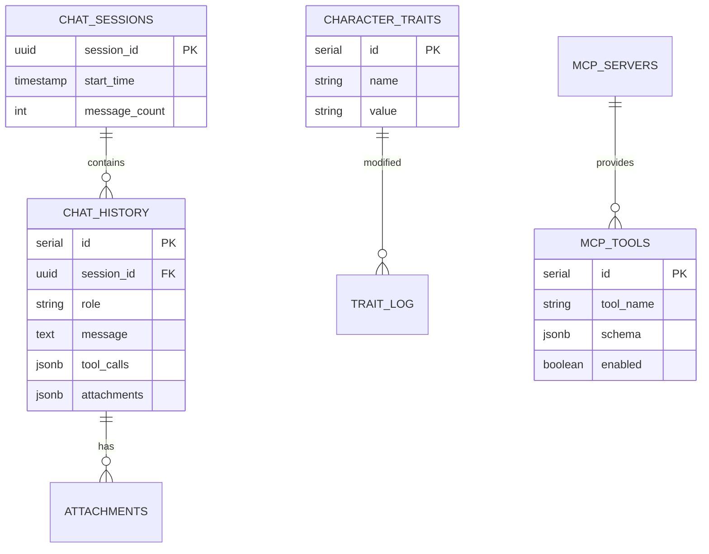
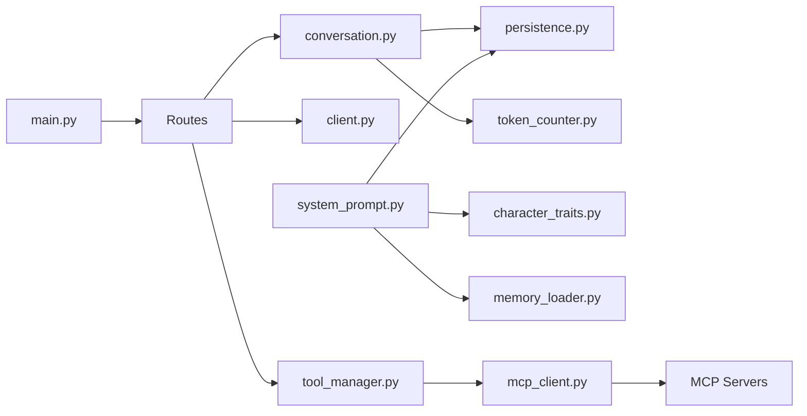
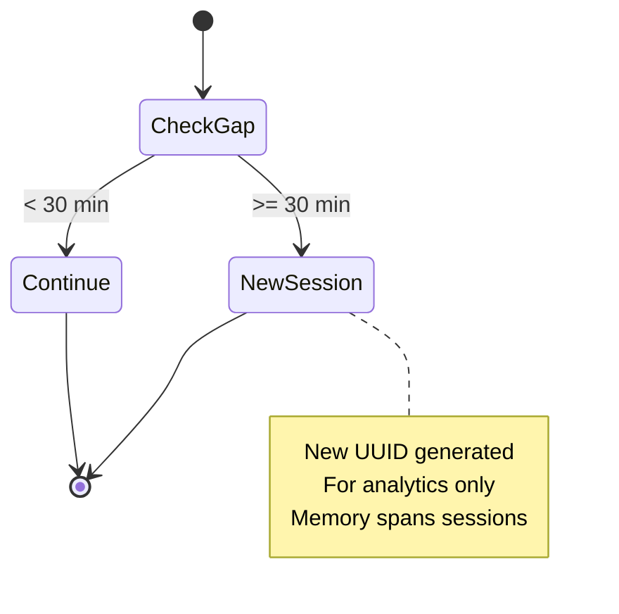
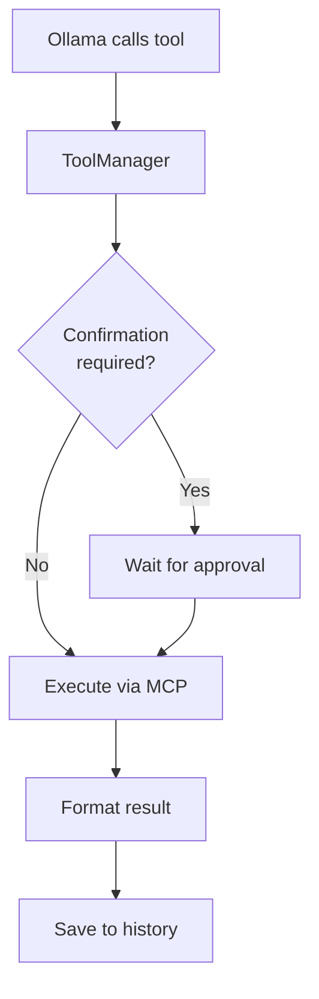

# Iris v3 - System Architecture Map

**Generated**: December 6, 2025  
**Codebase**: ~6,100 lines of Python  
**Model**: Qwen 2.5 14B (configurable)  
**Context Window**: 32,768 tokens

---

## Table of Contents

1. [High-Level System Overview](#high-level-system-overview)
2. [Core Request Flow](#core-request-flow)
3. [Database Schema](#database-schema)
4. [Module Dependencies](#module-dependencies)
5. [Token Budget](#token-budget)
6. [Session Management](#session-management)
7. [Tool Execution](#tool-execution)
8. [Image Flow](#image-flow)
9. [Context Assembly](#context-assembly)
10. [MCP Architecture](#mcp-architecture)
11. [Quick Reference](#quick-reference)

---

## High-Level System Overview

---

## Core Request Flow

---

## Complete Turn Flow (Linear)

Simple step-by-step flow from user message to assistant response:

**Key Points**:
- **Context Assembly**: Steps 2-7 build the complete context
- **Two Paths**: Tool execution path vs. direct response path
- **Two Ollama Calls**: First with tools (if used), second for streaming
- **Database Saves**: User message, tool results, assistant message(s)

---

## Database Schema

**Critical**: Sessions are for analytics only. Memory loads across ALL sessions!

---

## Module Dependencies

---

## Token Budget

**Total Context**: 32,768 tokens

| Component | Tokens | Priority |
|-----------|--------|----------|
| System Prompt | 600 | Fixed |
| Character Traits | 200 | Fixed |
| Response Buffer | 2,500 | Fixed |
| Episodic Memory | 2,500 | High |
| Tool Definitions | 1,500 | Medium |
| Tool Results | 800 | Medium |
| Conversation | 7,000 | Low |

**Truncation Order**: Oldest conversation → Tool results → Tool defs → Memory

---

## Session Management

---

## Tool Execution

---

## Image Flow

**User Uploads**:
1. Base64 in WebSocket → Save to `attachments/user/`
2. Create metadata → Save to `attachments` table
3. Add to `chat_history.attachments` JSON

**Tool Generated**:
1. Tool returns filename
2. Load file → Encode base64
3. Save to `attachments/generated/`
4. Add metadata to DB

**Context Loading**:
1. Load messages with attachments JSON
2. Parse JSON → Load files → Encode
3. Add `images` array to message
4. Send to Ollama with images

---

## Context Assembly

1. **System Message**: Load instructions + traits + memories
2. **Load History**: Last 30 turns across ALL sessions
3. **Process Images**: Parse attachments, load files, encode
4. **Format**: Add role, content, tool_calls, images
5. **Token Check**: Truncate if over 12,000 tokens

---

## MCP Architecture

**Servers**:
- **info_server**: weather, news, web search
- **traits_server**: personality modification
- **creative_server**: image generation (ComfyUI)

**Communication**: stdio/JSON-RPC  
**Lifecycle**: Managed by MCPClient  
**Tool Discovery**: Schemas in database

---

## Quick Reference

| Change | File |
|--------|------|
| Model | `config.py` → OLLAMA_MODEL |
| Context window | `config.py` → OLLAMA_CONTEXT_WINDOW |
| Session timeout | `config.py` → SESSION_TIMEOUT_MINUTES |
| Token limits | `config.py` → MAX_CONTEXT_TOKENS |
| Chat flow | `routes_chat.py` |
| Context assembly | `system_prompt.py` |
| Message loading | `persistence.py` |
| Tool execution | `tool_manager.py` |
| Add MCP server | `mcp_servers/{name}/` + `server_configs.py` |
| System prompt | Database: `system_instructions` table |

---

## Architecture Principles

1. **Session-Independent Memory**: Load across ALL sessions
2. **Token Governance**: Multi-level limits with priorities
3. **Database-Driven**: Prompts and tools from PostgreSQL
4. **Streaming**: Real-time WebSocket updates
5. **Vision**: Images throughout entire pipeline
6. **MCP Tools**: Modular, extensible tool system
7. **Explicit Context**: Always set `num_ctx` for Ollama

---

**Documentation Generated**: December 6, 2025
